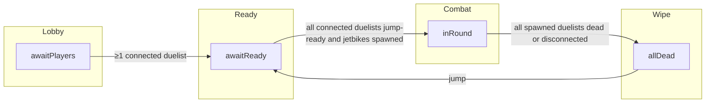

# Forever match (`ForEver`) — flow reference

This document describes the control flow in `public/engine/game/match/for_ever.js`, how it extends the base `Match` class in `match.js`, and how replicated fields sync to clients. Pair with `docs/for-honor-match-flow.md` for shared patterns (ready inputs, purge grace, `super.step` ordering).

## Match type and limits

- **`matchType`**: `'ForEver'`
- **Players**: **minimum 1**, **maximum 4** non-spectator duelists (`playerLimit`). Beyond four connected duelists, extras are forced to **spectator** and lose any spawned character (server tick).
- **Map**: `Maps.Map_FieldCity`
- **HUD**: **Wave counter**, **match timer**, **approximate seconds until next wave** — no scoreboard.

## Stage state machine

Authoritative `stage` runs on the server (`typeof window === 'undefined'`); clients mirror `pack()` plus simulation snapshots.

### `awaitPlayers`

- Overrides base behavior: when **at least one** connected non-spectator exists, clears ready flags (via transition pattern) and moves to **`awaitReady`** (same spirit as For Honor leaving the empty lobby).

### `awaitReady`

- **Jump** (edge on `controller.buttons.jump`) sets **`playerReady[tokenId]`** and **`player.ready`**.
- **Every** connected non-spectator duelist (up to the player cap) must be ready before combat starts.
- On the **first** satisfied gate: spawns **Jetbike** characters for every **ready** duelist under the cap who does not already have a character, records their token ids in **`foreverSpawnedIds`**, starts **`matchStartTick`** and **`nextWaveAtTick`**, sets **`waves`** to `0`, then **`stage = inRound`**.

### `inRound`

- **Drop-in**: additional duelists who press jump while slots remain spawn their Jetbike when ready (same spawn helper as round entry).
- **Permadeath**: when a human-owned jetbike becomes inactive (`hp` exhaustion path sets `active = false`), the parent **Player** is marked **`spectator = true`** and the entity is marked **`cleanup`** so base compaction removes it on the next tick.
- **Full wipe**: if **`foreverSpawnedIds`** is non-empty and **no** spawned duelist is still a **connected** non-spectator with an **`active`** character (dead, spectator, or disconnected), the match captures **`finalWaveSummary`** / **`finalElapsedTicks`**, clears combat roster, and sets **`stage = allDead`**.
- **Waves**: every **`waveTime`** ticks (default `2700`), **`waves`** increments and the server spawns enemy bots, ammo/health pickups, a central weapon pickup, and (on even wave counts) ally bots — ported from the legacy Forever wave logic.

### `allDead`

- Overlay shows **waves reached** and **survival time** derived from **`finalElapsedTicks`** (tick delta ÷ 60 for display).
- **Jump** triggers a **restart** on the server: transient pickups stripped (`blocks` filtered to static **`type === 'block'`** only), **`characters`** / **`bots`** cleared, **`foreverSpawnedIds`** reset, all **`game.players`** duelists cleared from **`spectator`**, ready flags cleared, opening pickups **re-seeded**, **`stage = awaitReady`**.

## Server tick preamble (before `super.step`)

Same discipline as For Honor:

1. **`purgeDisconnectedDuelistsPastGrace()`** — removes duelists disconnected longer than **`DISCONNECT_EJECT_MS` (10 000 ms)**; strips characters and **`playerReady`** / **`foreverSpawnedIds`** entries for removed tokens.
2. **Max-four enforcement** — overflow duelists become spectators and lose characters.

Then **`super.step()`** runs base simulation (characters, map, bullets, compaction).

Mode logic runs **after** `super.step()` so death (`hp <= 0`) is observed before permadeath tagging.

## `pack()` fields (network / client HUD)

| Field | Role |
|--------|------|
| `stage` | Lobby / ready / combat / wipe overlay |
| `playerReady` | Jump-ready map by token id |
| `foreverSpawnedIds` | Duelists who spawned at least once this match |
| `waves` | Completed wave count (incremented each wave tick) |
| `waveTime` | Ticks between waves |
| `nextWaveAtTick` | Server tick when the next wave fires |
| `matchStartTick` | Anchor for elapsed timer |
| `finalWaveSummary` | Waves reached when wipe occurred |
| `finalElapsedTicks` | Survival length in ticks at wipe |

Clients merge these in `socket_client.js` alongside For Honor fields.

## Client rendering notes

- **`draw()`** draws the Field City world via **`super.draw()`** except **`awaitPlayers`** (map-only backdrop same as For Honor).
- Ready panel, combat HUD (wave / time / next wave), and wipe summary are drawn from replicated **`stage`** and numeric fields; jump prompts match **`jump`** binding behavior.

## Entry points

- **Menu**: `game.loadMatch('ForEver')` from `menus.js`.
- **Include order**: load `for_ever.js` after `match.js` / `match_forhonormp.js` and before `game.js` (`views/client.ejs`).
- **Node**: `game.js` **`require('./match/for_ever.js')`** attaches **`Matches.ForEver`**.
