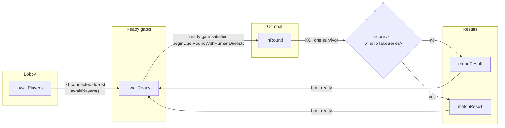
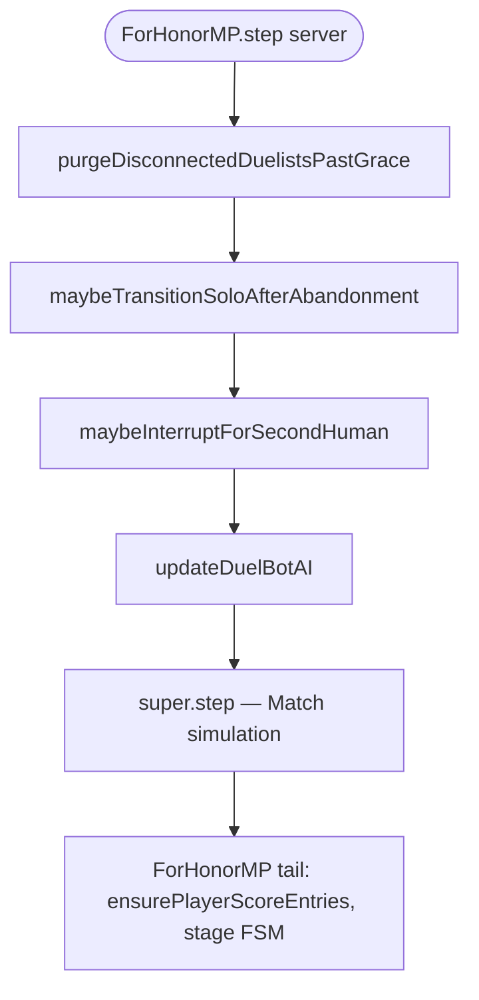
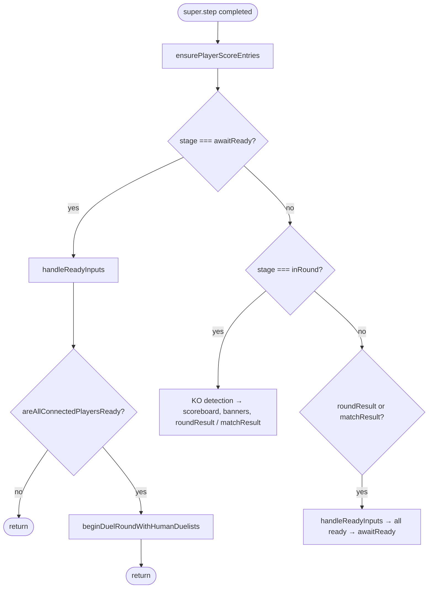
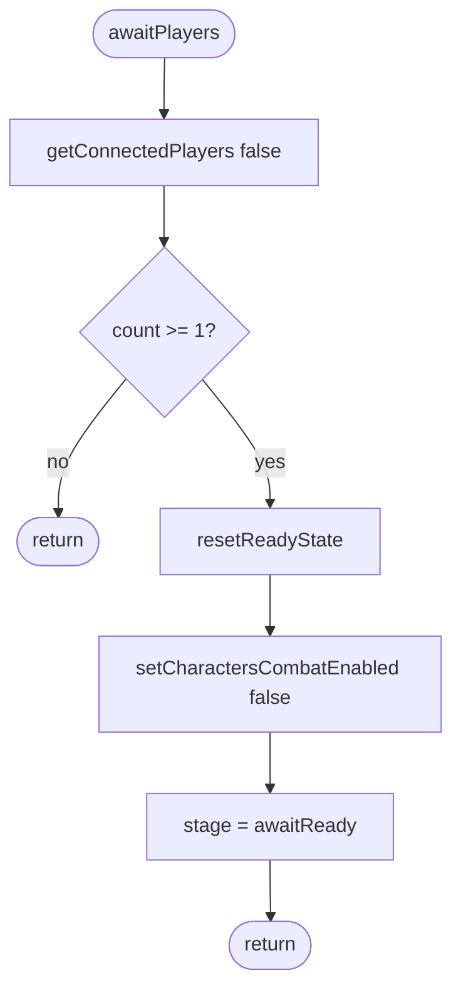
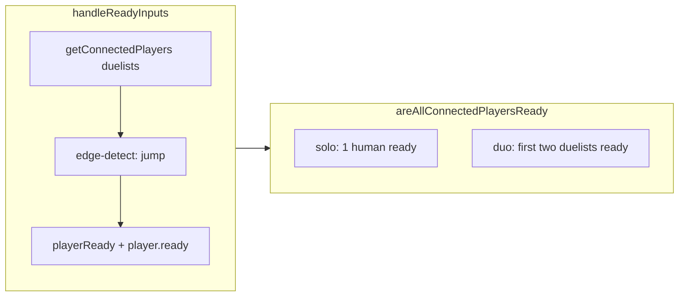

# For Honor match (`ForHonorMP`) — flow reference

This document maps the control flow implemented in `public/engine/game/match/match_forhonormp.js` and how it plugs into the base `Match` class in `match.js`, plus related player/sync behavior. Use it when debugging rounds, ready gates, bots, disconnects, or HUD overlays.

## Stage state machine (authoritative progression)

The server drives `stage`; clients mirror replicated state. Mode logic inside `ForHonorMP.step()` (after the preamble — see below) runs only when `typeof window === 'undefined'` (headless server).

**Notes**

- **`awaitPlayers`** leaves the lobby when **at least one** connected duelist exists (`getConnectedPlayers(false).length >= 1`). Bots **never** count toward connections (`Players.Bot` is not in `game.players`).
- The override does **not** follow the base class transition to `startMatch`; it sets **`awaitReady`**.
- **Ready gate**: **one** connected duelist only needs themself ready (solo queue → CPU fills the second slot at round start). **Two** connected duelists: both must jump‑ready (first two slots).
- **`roundResult` vs `matchResult`** depends on whether the winner’s cumulative round wins reached `winsToTakeSeries` (majority of `roundsTotal`; default Bo3 → first to 2).

## Server tick preamble (before `super.step()`)

On the server only, `ForHonorMP.step()` runs **in order**, **before** `super.step()`:

1. **`purgeDisconnectedDuelistsPastGrace()`** — Non‑spectators disconnected longer than **`DISCONNECT_EJECT_MS` (10 000 ms)** (aligned with `game.countConnections`) are removed from **`game.players`**, their characters stripped, ready/score keys cleared, and **`ws.close()`** attempted.
2. **`maybeTransitionSoloAfterAbandonment()`** — If exactly **one** connected duelist remains **and** recovery applies (`participantIds` references a removed token **or** a purge happened this tick while solo), **`transitionSoloHumanToImmediateCpuDuel()`** resets series scores and calls **`beginDuelRoundWithHumanDuelists([solo])`** → **`inRound`** vs CPU **without** waiting on **`awaitReady`** / result banners.
3. **`maybeInterruptForSecondHuman()`** — If **≥2** connected duelists **and** **`duelBotParent`** exists, **`dismissDuelBotAndResetForHumans()`**: removes CPU (`removeDuelBotFully`), clears scores/banner, **`awaitReady`** for a fair human‑vs‑human gate.
4. **`updateDuelBotAI()`** — Fills the duel bot’s synthetic controller for **`inRound`** combat.

Then **`super.step()`** runs base simulation (`character.step`, map, bullets, compaction, …).

## Where `Match.step` vs `ForHonorMP` body run

Base **`Match.step`**: if `stage === 'awaitPlayers'`, calls **`awaitPlayers()`** and **returns** (no character/map simulation that tick). Otherwise full sim.

**`ForHonorMP` body** (server, after `super.step`): `ensurePlayerScoreEntries`, then **`awaitReady` / `inRound` / result** stage handling (ready inputs, `beginDuelRoundWithHumanDuelists` from the ready gate, KO resolution, result → **`awaitReady`**).

**Clients** return immediately after `super.step()` in the `ForHonorMP` override for the mode FSM (they only apply **`pack()`** / network updates and **`draw()`**).

## `ForHonorMP` body — server-only stage branches (simplified)

`beginDuelRoundWithHumanDuelists(duelPlayers)` centralizes: set **`participantIds`** (add **`FOR_HONOR_BOT_TOKEN_ID`** if solo), filter/spawn **Jetbikes**, **`ensurePlayerScoreEntries`**, **`resetRound()`**, **`stage = inRound`**.

## Solo vs CPU duel bot

- Stable token: **`__for_honor_duel_bot__`** (`FOR_HONOR_BOT_TOKEN_ID`).
- **`duelBotParent`**: a **`Players.Bot`** instance (not in `game.players`), with **`createDuelBotController()`** for **`updateDuelBotAI()`**.
- **`stripDuelBotCharacter()` / `removeDuelBotFully()`**: remove any character whose **`parent.token.id`** is the bot token (not only reference equality).
- Second human joins during a CPU duel → **`dismissDuelBotAndResetForHumans()`** (see preamble).

## `awaitPlayers()` (override)

## `resetRound()` — start-of-round work

Unchanged in spirit: **`super.reset`**, clear transient banner/result fields, filter **`map.blocks`** to static **block** types, per‑character respawn and loadout, then **server‑only** pickups and floating weapon pickups.

## Ready input and gates

- **`handleReadyInputs`**: edge‑detect **`jump`** (`jump.current && !jump.last`), not fire.
- **`areAllConnectedPlayersReady`**: **0** players → false; **1** connected duelist → that player must be ready; **≥2** → each of **`slice(0, playerLimit.max)`** must be ready.

## Client HUD (`draw()`)

Same layering as before: ready panel vs fullscreen result banner vs **inRound** score strip; **`buildScoreLine`** names **`Bot`** for the CPU token id; second slot can show **Bot / CPU** when **`participantIds`** includes the bot token and only one human is connected.

Prompt text: **`getInputPromptText()`** — duelists see jump‑to‑ready; spectators see fire‑for‑camera where applicable.

## Network sync and disconnected duelists

### `Player.pack()` (`player.js`)

Disconnect broadcasts use **`player.pack()`**. The payload includes **`connected: this.connected === true`**, **`spectator`**, **`ready`**, so clients can treat disconnected duelists as not connected and **`getConnectedPlayers`** excludes them on the **ready‑up panel**.

### Match `pack()` extras

Besides **`stage`**, **`scoreboard`**, **`playerReady`**, **`participantIds`**, **`banner`**, series fields, **`lastWinner`**, **`matchWinner`**:

- **`duelBotActive`**: `!!duelBotParent`
- **`forHonorBotTokenId`**: constant bot token string for UI/sync

### `socket_client.js` — match message handling

When **`message.match`** is applied:

- Sync **`duelBotActive`** / **`forHonorBotTokenId`** onto **`game.match`** when present.
- If **`duelBotActive === false`**, or **`participantIds`** is updated and **does not** include the bot token, **remove** client‑side characters whose **`parent.token.id`** is the For Honor bot id (character deltas often omit removals).

## Serialized state (`pack()`)

See constructor hydration in **`match_forhonormp.js`** for reconstructing from **`options`**.

## File reference

| Area | Location |
|------|----------|
| Mode class | `public/engine/game/match/match_forhonormp.js` |
| Base tick / lobby hook | `public/engine/game/match/match.js` → `Match.step`, `Match.awaitPlayers` |
| Instantiation | `public/engine/game/game.js` → `Matches.ForHonorMP` |
| Player sync / disconnect fields | `public/engine/game/player/player.js` → `Player.pack()` |
| Client match + CPU strip | `public/engine/socket_client.js` → `message.match` handling |
| Disconnect / reconnect WS | `public/engine/socket_server.js` → close handler sets **`connected = Date.now()`** |
| Browser script order | `views/client.ejs` — **`player.js`** before **`match_forhonormp.js`** so **`Players`** exists for the bot |
